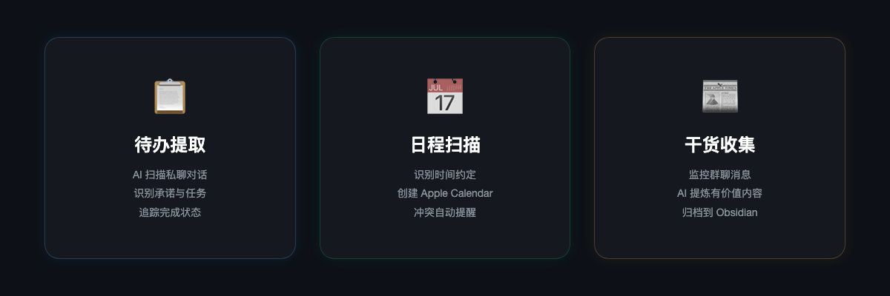
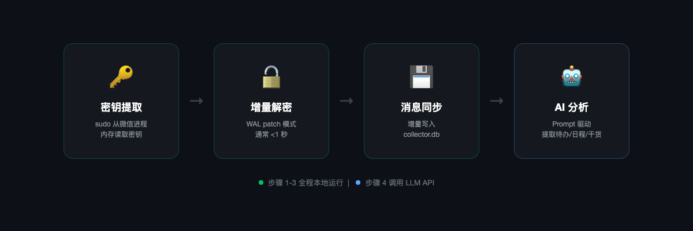

<p align="center">
  
</p>

<p align="center">
  <b>OpenClaw Skill</b> — 微信 AI 个人助手<br>
  自动从微信聊天中提取待办、日程、干货，推送到 Discord，闭环追踪任务状态。<br>
  <i>念念不忘，必有回响 — Important messages always echo back.</i>
</p>

<p align="center">
  <a href="#-安装">安装</a> · <a href="#-功能">功能</a> · <a href="#-工作原理">原理</a> · <a href="#-增量解密">增量解密</a> · <a href="#-参与共建">共建</a>
</p>

---

## 🦞 快速开始

把这段话发给你的 Agent（大黄 / Claude / 任何 OpenClaw Agent）：

> 帮我安装 wx-echo skill：先 `git clone https://github.com/laolin5564/openclaw-wx-echo` 到 `~/.openclaw/skills/wx-echo`，然后按 SKILL.md 引导我设置

Agent 会自动：克隆代码 → 编译密钥提取工具 → 提取密钥 → 解密数据库 → 同步消息 → 注册定时任务。

> ⚠️ 需要 **macOS** + **微信桌面版 4.0+** 正在运行 + `pip3 install pycryptodome zstandard pyyaml`

---

## ✨ 功能

<p align="center">
  
</p>

| 功能 | 说明 | 频率 |
|------|------|------|
| **📋 待办提取** | 扫描私聊，识别承诺和任务，推送到 Discord | 每 30 分钟 |
| **📅 日程扫描** | 识别时间约定，创建 Apple Calendar 事件 | 每 30 分钟（8-23 点）|
| **📰 干货收集** | 监控群聊，AI 提炼有价值内容，归档 Obsidian | 每天 9:00 |

### 隐私

数据提取（解密、同步、JSON 输出）**全程本地运行**。AI 分析阶段，提取后的聊天摘要会发送到你配置的大模型 API。原始加密数据库不会离开本机。

---

## ⚙️ 工作原理

<p align="center">
  
</p>

两层设计：

- **Layer 1 — CLI 工具**（`scripts/`）：纯 Python，不依赖 OpenClaw，只做数据提取，输出 JSON
- **Layer 2 — Prompt 模板**（`prompts/`）：Agent 读模板 → 调 CLI → 分析 JSON → 推送 Discord

想改分析逻辑？改 `prompts/*.md`，不用动代码。

---

## 🚀 安装

```bash
git clone https://github.com/laolin5564/openclaw-wx-echo.git ~/.openclaw/skills/wx-echo
```

然后跟 Agent 说：`帮我设置微信助手`

### 环境要求

| 依赖 | 版本 |
|------|------|
| macOS | 13+（ARM64 / Intel） |
| 微信桌面版 | 4.0+ |
| Python | 3.8+ |
| OpenClaw | 最新版 |

```bash
pip3 install pycryptodome zstandard pyyaml
```

### 设置步骤

Agent 会引导你完成，也可以手动：

1. **编译密钥工具** — `cc -O2 -o find_all_keys_macos scripts/decrypt/find_all_keys_macos.c`
2. **提取密钥** — `sudo ./find_all_keys_macos`（微信必须正在运行）
3. **创建配置** — 复制 `config.example.yaml` → `config.yaml`，填入路径
4. **全量解密** — `python3 scripts/decrypt/decrypt_db.py --config config.yaml`
5. **首次同步** — `python3 scripts/collector.py --config config.yaml --sync`
6. **注册 Cron** — Agent 自动创建 3 个定时任务

---

## 🔐 增量解密

微信 4.0 使用 SQLCipher 4 加密本地数据库。全量解密一次约 19GB，很慢。

但 SQLite 的 WAL 模式下，新消息写入 `.db-wal` 文件。`refresh_decrypt.py` 只解密变化的 WAL frame 并 patch 到已解密的 DB：

- 一个 4MB WAL patch ≈ **70ms**
- 定时任务每次先跑这个，几乎无感知
- 微信重启后密钥会变，脚本自动检测并提醒

---

## 📁 文件结构

```
scripts/
  decrypt/
    find_all_keys_macos.c     — 从微信进程内存提取密钥（C，需 sudo）
    decrypt_db.py              — 全量解密（首次用）
    config.py                  — YAML 配置加载
  refresh_decrypt.py           — 增量解密（定时用，WAL patch）
  collector.py                 — 消息同步到 collector.db
  extract_todos.py             — 私聊待办 → JSON
  extract_calendar.py          — 日程对话 → JSON
  extract_digest.py            — 群聊干货 → JSON
prompts/
  todo-scan.md                 — 待办扫描 prompt 模板
  calendar-scan.md             — 日程扫描 prompt 模板
  digest.md                    — 干货收集 prompt 模板
config.example.yaml            — 配置模板
SKILL.md                       — Agent 读这个
```

---

## 📝 Prompt 模板

`prompts/*.md` 是 cron 任务的指令模板。注册 cron 时替换占位符：

| 占位符 | 含义 |
|--------|------|
| `{{config_path}}` | config.yaml 绝对路径 |
| `{{skill_dir}}` | skill 根目录 |
| `{{forum_id}}` | Discord Forum 频道 ID |
| `{{groups}}` | 监控群 ID（逗号分隔） |
| `{{ssh_host}}` | 微信机器 SSH 地址（本机留空） |

---

## ⚠️ 已知限制

| 级别 | 问题 | 说明 |
|------|------|------|
| 🔴 | 微信重启后密钥失效 | 需重新 `sudo find_all_keys_macos` |
| 🟡 | Windows 支持 | 基础编码兼容，密钥提取待适配 |
| 🟡 | 首次同步慢 | 历史消息多时几分钟，可 `--chatroom` 分批 |

---

## 🤝 参与共建

- **跑一遍** — 不同微信/macOS 版本的兼容性反馈
- **新 prompt** — 改变 AI 分析方式，只需加一个 `.md` 文件
- **新 extract 脚本** — 输出 JSON 就行，prompt 跟着加
- **Windows 适配** — 密钥提取 + 路径处理
- **Bug 修复** — Issue 或 PR

---

## 致谢

核心解密逻辑基于 [bbingz/wechat-decrypt](https://github.com/bbingz/wechat-decrypt/tree/feat/macos-support)。

## License

MIT
